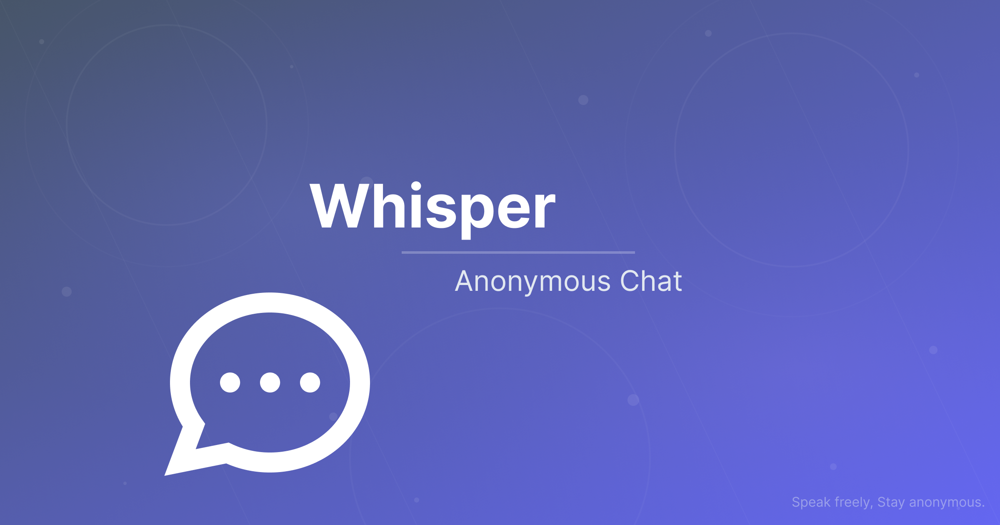

  

<h1 align="center">
  🌙 Whisper
</h1>

  <strong>Speak freely. Stay anonymous.</strong> 
  A serene, no‑tracking anonymous chatroom. No accounts, no email – just quiet conversation.

  
  
  

  
  
  
  
  

---

## ✨ Features at a glance

| 🌱 Anonymity | 💬 Real‑time | 📎 Files | 🔔 Notifications | 📱 PWA |
|--------------|--------------|----------|------------------|--------|
| No accounts, no emails – you get a unique, never‑reused name | Messages appear instantly via Socket.IO | Share images & docs up to 10 MB | Optional push alerts for new messages | Install like a native app, works offline (shell) |

### 🧘 A calm space
- **No tracking** – zero analytics, no third‑party scripts.
- **Transient messages** – only the last 500 messages are stored in memory; older ones vanish forever.
- **Moderation** – admin panel to keep the room peaceful (delete messages, broadcast, rename users).
- **Responsive & beautiful** – works on phones, tablets, and desktops with a soothing gradient (`#1e293b` → `#312e81`).

---

## 🛠️ Tech Stack (in a nutshell)

  
  
  
  
  

- **Backend**: Node.js + Express + Socket.IO
- **Frontend**: HTML + TailwindCSS + vanilla JS (PWA)
- **Storage**: In‑memory (messages) + JSON files (taken names)
- **Notifications**: Web Push API + Service Worker

---

## 📁 Key files

---

## 🧭 Philosophy

> Whisper is a **digital campfire** – no identities, no archives, no noise.  
> Just people talking.

The design is minimal, the colors are calm, and the only goal is to let you **speak freely** without leaving a permanent trace.

---

## 📄 Legal & contact

- **Terms of Service** – [`/tos`](https://whisper.arsan.my/tos)
- **Privacy Policy** – [`/privacy-policy`](https://whisper.arsan.my/privacy-policy)
- **FAQ** – [`/faq`](https://whisper.arsan.my/faq)

**Maintainer**: [Arsan (Argzf)](https://github.com/Argzf)  
📬 Discord: `@gzf` (User ID `935053416877666304`)

---

## 📜 License

This project is licensed under the **Proprietary Source‑Visible License (PSVL)**.  
You may view, fork, and study the code for personal or educational purposes, but you may **not** copy, modify, distribute, or use substantial portions of the project for any commercial or production purpose without explicit written permission from the maintainer.

---

  <i>Made with ☕ and a quiet mind.</i> 
  

